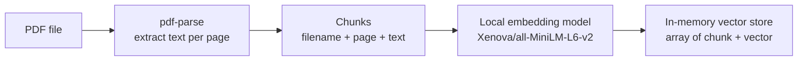

# semantic-search — SPECIFICATIONS

## 1. Goal and scope

**Goal:** Provide a CLI tool that indexes PDF documents using embedding vectors and answers natural-language queries by returning ranked results that identify the relevant PDF filename and page number.

**Scope:** CLI only — no server, no UI.  
Two operations:
- **index** — process a PDF and build an in-memory vector index.
- **query** — accept a natural-language question and return ranked results.

---

## 2. Tech stack

| Concern | Choice |
|---|---|
| Runtime | Node.js with TypeScript |
| Embeddings | Local model only (no cloud API) — use [`@xenova/transformers`](https://github.com/xenova/transformers.js), specifically the `Xenova/all-MiniLM-L6-v2` sentence-embedding model |
| Vector store | In-memory only (array of vector + metadata objects); no persistence to disk |
| PDF text extraction | [`pdf-parse`](https://www.npmjs.com/package/pdf-parse) |
| CLI framework | [`commander`](https://www.npmjs.com/package/commander) |
| Language | TypeScript 5.x, compiled with `tsc` or run with `ts-node` |

---

## 3. Chunking strategy

One chunk per PDF page. Each chunk stores:
- `filename` — basename of the source PDF file
- `page` — 1-based page number
- `text` — extracted text content for that page
- `vector` — float32 embedding vector

This guarantees every query result has an unambiguous page number.

---

## 4. CLI interface

**Binary name:** `docsearch`

### 4.1 Index command

```
docsearch index --file <path-to-pdf>
```

| Flag | Required | Description |
|---|---|---|
| `--file <path>` | yes | Absolute or relative path to the PDF to index |

**Behavior:**
1. Read and parse the PDF file.
2. Extract text for each page (skip empty pages silently).
3. Compute an embedding vector for each page's text using the local model.
4. Store the resulting chunks in memory.
5. Print a confirmation line to stdout: `Indexed <N> pages from <filename>`.

No persistence — the index exists only for the lifetime of the process. A combined index-then-query workflow (see §6 Demo) must be done in a single invocation or via shell composition (see §4.3).

### 4.2 Query command

```
docsearch query --file <path-to-pdf> --question "<question>"
```

| Flag | Required | Description |
|---|---|---|
| `--file <path>` | yes | PDF to index before querying (index is built on-the-fly) |
| `--question <text>` | yes | Natural-language question |
| `--top <number>` | no | Number of results to return (default: **5**) |

**Behavior:**
1. Index the PDF (same steps as index command, §4.1).
2. Embed the question string.
3. Compute cosine similarity between the question vector and every page vector.
4. Sort results by descending similarity.
5. Print the top-k results (default 5) to stdout.

### 4.3 Output format — query results

```
Results for: "<question>"

1. report.pdf  page 4
2. report.pdf  page 7
3. report.pdf  page 2
4. report.pdf  page 11
5. report.pdf  page 9
```

Rules:
- First line: `Results for: "<question>"` followed by a blank line.
- One result per line: `<rank>. <filename>  page <page_number>`.
- Filename is the basename of the file (not the full path).
- No similarity score shown in plain-text mode (score used internally for ranking only).

---

## 5. Data flow

### Index flow



### Query flow


---

## 6. Out of scope (v1)

- No persistence of the vector index between invocations.
- No incremental update or append to an existing index.
- No config file — CLI flags only.
- No support for non-PDF file formats.
- No multi-file indexing in a single command invocation.
- No similarity score in the output.

---

## 7. Demo and verification

### 7.1 Sample document

Use a publicly available PDF that covers a well-known technical topic so correctness of the results can be verified without special domain knowledge. A good candidate:

> **"Attention Is All You Need"** (Vaswani et al., 2017) — the original Transformer paper, freely available at <https://arxiv.org/pdf/1706.03762>.

Save it as `samples/attention-is-all-you-need.pdf` inside the project.

### 7.2 Verification steps

1. **Index + query** in a single command:

```bash
docsearch query \
  --file samples/attention-is-all-you-need.pdf \
  --question "What attention mechanism is proposed in this paper?"
```

Expected: top results should point to pages covering the "Scaled Dot-Product Attention" and "Multi-Head Attention" sections (pages 3–4 in the original paper).

2. **Second question:**

```bash
docsearch query \
  --file samples/attention-is-all-you-need.pdf \
  --question "What datasets were used for training the translation model?"
```

Expected: results should include the page(s) covering the training data section (WMT 2014 English-German and English-French datasets, roughly page 7).

3. **Third question:**

```bash
docsearch query \
  --file samples/attention-is-all-you-need.pdf \
  --question "What is the BLEU score achieved on English-to-German translation?"
```

Expected: results should include pages covering the results table (page 8).

### 7.3 Pass criteria

For each question, manually verify that at least one of the top-3 returned page numbers corresponds to a page in the PDF where the answer actually appears. Verification is manual — no automated test script is required for v1.
